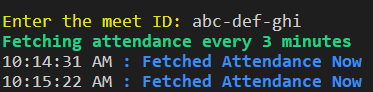

# Attendo Meet Attendance Fetcher

Fetches attendance of a given Google Meet ID every 5 mins and saves the attendance on a sheet

Made in collaboration with Team Attendo

[Attendo Repository](https://github.com/mak626/attendo)

## .env Config

`API_KEY`

## Setup

`npm install`

## Running

- `npm start`

- Enter the meet id in terminal and your attendances will be saved as `{meet-id} {DATE}.csv` at `/attendances` every 3 minutes

  

- Note the bot will send a accept request to the meet to get attendance for the first time. Subsequent fetches won't need join permission

